# Practical Deep Raw Image Denoising on Mobile Devices

The Tensorflow Reimplementation based the [Practical Deep Raw Image Denoising on Mobile Devices - ECCV 2020](https://www.ecva.net/papers/eccv_2020/papers_ECCV/papers/123510001.pdf).

Note: Istead of training with RGGB pattern, input of this mode is noisy sRGB image.

##  Content
- [Practical Deep Raw Image Denoising on Mobile Devices](#practical-deep-raw-image-denoising-on-mobile-devices)
  - [Content](#content)
  - [Getting Started](#getting-started)
  - [Running](#running)
    - [Result](#result)
  - [References](#references)

## Getting Started

- Clone this repository and run on [Colab](https://colab.research.google.com/notebooks/intro.ipynb).

## Running

- Creating Data
  - Clone the repository [CycleISP](https://github.com/swz30/CycleISP) to generate pairs clean and noisy image.

  ```
  python generate_rgb_data.py --input_dir <path to clean images folder> --result_dir <path to output>
  ```

- Change path variables in Deep_Raw_Image_Denoising.ipynb

- Run file ipynb to train model.


### Result

This result acquired after training 20 epochs, input shape: 256*256*3. Number of pairs images is 2476.

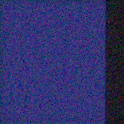 | 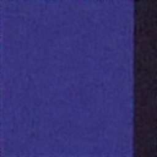 | 
|:---:|:---:|:---:|
 |  | 
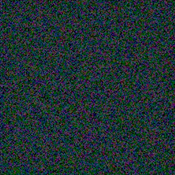 | 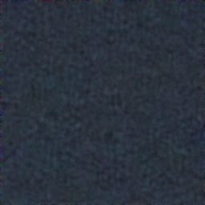 | 
 |  | 
 | 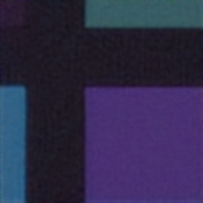 | 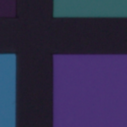
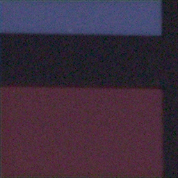 | 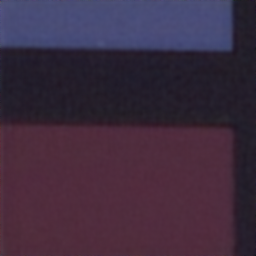 | 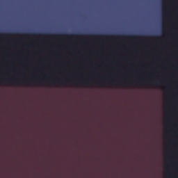
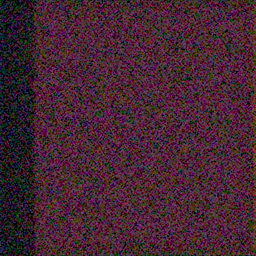 | 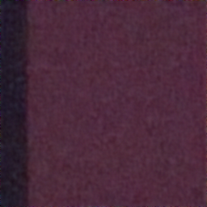 | 
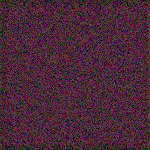 | 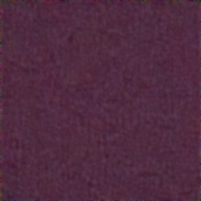 | 
| input | output | target


## References
[1] [Practical Deep Raw Image Denoising on Mobile Devices - ECCV 2020](https://www.ecva.net/papers/eccv_2020/papers_ECCV/papers/123510001.pdf).

[2] [SIDD Dataset](https://www.eecs.yorku.ca/~kamel/sidd/)
